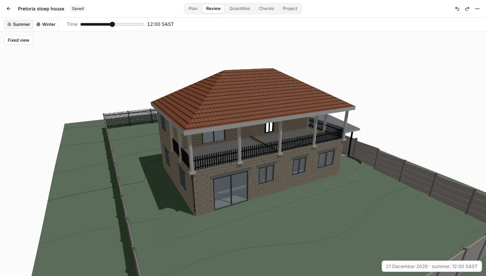
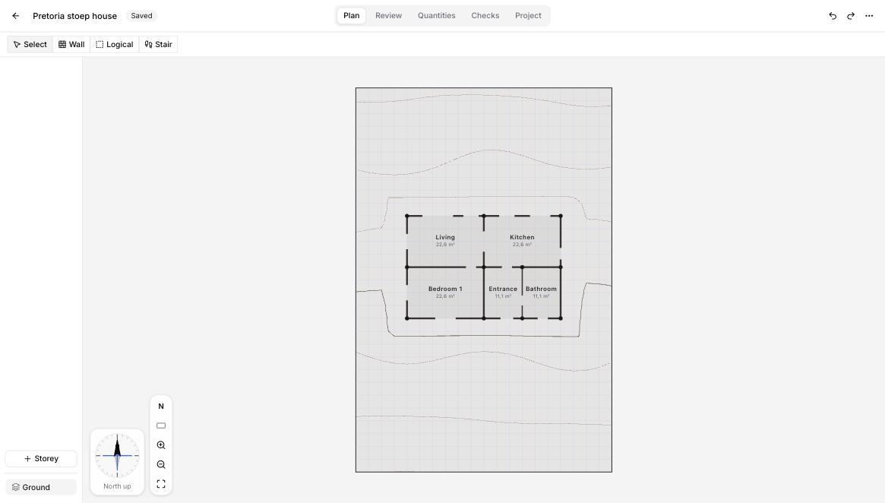
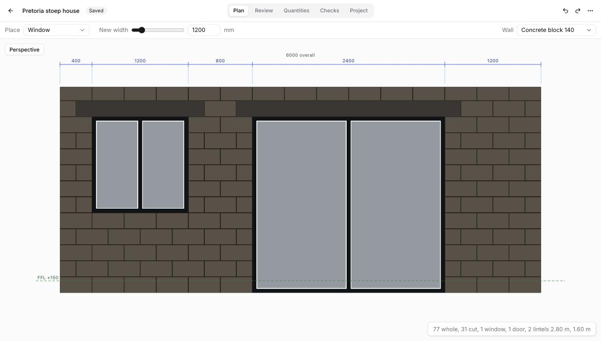
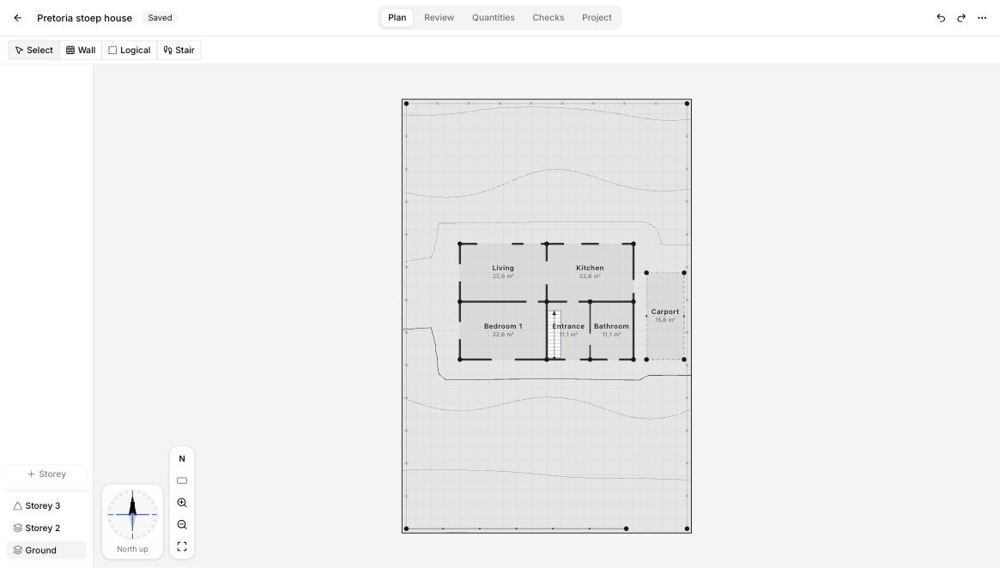
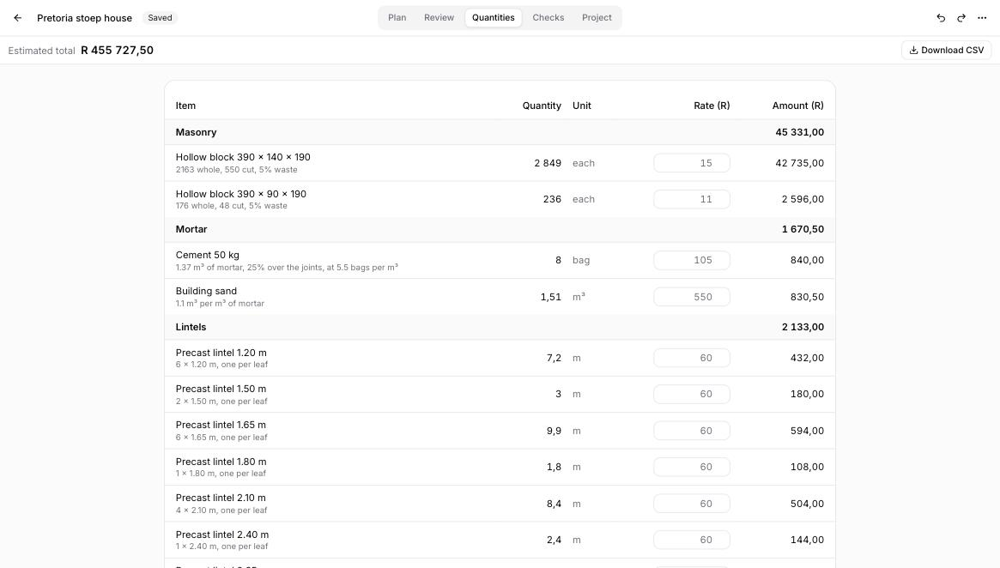
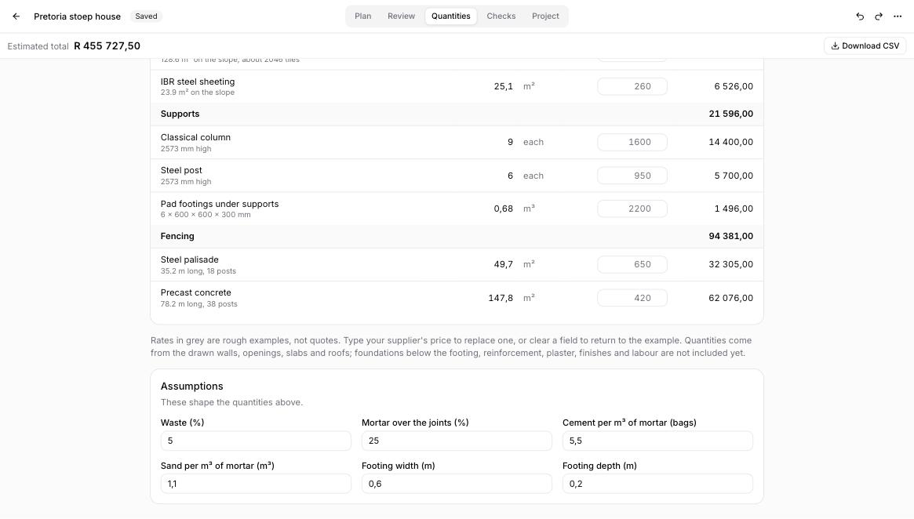
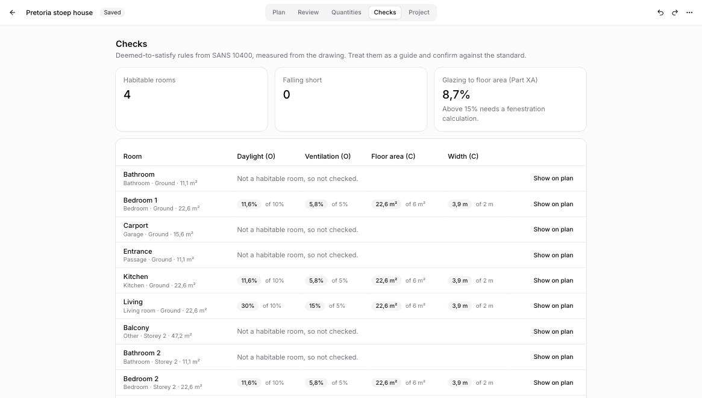

# Floorplan

Brick-by-brick house design in the browser, priced and checked as you draw.

**[floorplan.ferma.in](https://floorplan.ferma.in)**

Floorplan is a design tool for small, low-cost houses in South Africa. You draw on a real-shaped, sloping plot. Walls are courses of real bricks and blocks, and the drawing gives you a bill of quantities and the SANS 10400 deemed-to-satisfy checks as you go. It runs entirely in your browser: there is no account, and your projects stay on your machine.



*The house in the pictures was drawn from a blank project on the app's gentle north-facing sample plot. It is a 12 × 8 m house in 140 mm hollow block, with a covered balcony, a stair, a carport and boundary fencing.*

> [!IMPORTANT]
> Floorplan helps you think through a design and get a rough idea of its cost. It does not replace an architect, an engineer or plan approval. Rates are examples, not quotes. The checks are a guide to SANS 10400 and must be confirmed against the standard.

## Contents

- [A tour of the features](#a-tour-of-the-features)
- [Your data](#your-data)
- [Keyboard and mouse](#keyboard-and-mouse)
- [Known limits](#known-limits)
- [Running it locally](#running-it-locally)
- [How the code is organised](#how-the-code-is-organised)

## A tour of the features

### Start from a plot and a few defaults

**New project** is a short walkthrough:
1. Pick a sample plot, such as a level suburban stand or a steep north-facing slope, or bring your own boundary.
2. Choose what the walls are built from.
3. Choose the roof form, covering, pitch and eaves.
4. Set the standard window and door sizes.

These choices become the project defaults. You can change them later on the **Project** page, and each wall or roof can still differ. **Start with defaults** skips the walkthrough.

<p>
  
  
  
</p>

### Walls made of real units

A wall is a stack of courses, not a line with a thickness. Six wall systems are built in, each with its own unit size, course height, leaf thickness and cavity:

| System | Unit | Typical use |
| --- | --- | --- |
| Clay brick cavity | 222 × 106 × 73 | External walls |
| Clay brick solid 220 | 222 × 106 × 73 | External or load-bearing walls |
| Clay brick half 110 | 222 × 106 × 73 | Internal partitions |
| Maxi brick 140 | 290 × 140 × 90 | External walls, low-cost housing |
| Concrete block 140 | 390 × 140 × 190 | External walls, low-cost housing |
| Concrete block 90 | 390 × 90 × 190 | Internal partitions |

Openings snap to whole courses and to the half-unit, so cut units are counted rather than guessed.

### Plan



- **Drawing:** click corner to corner to draw walls, or tap Shift to draw a rectangle. A new wall becomes the grid reference, so the next one lines up with it.
- **Rooms:** they form wherever walls close, and each shows its net area. Name them and give them a type, such as bedroom, kitchen or bathroom. Rooms can be grouped, so an open-plan living and dining area counts as one.
- **Logical walls:** these divide or close off a space without building anything. They can carry a fence or supports, and a roof may rest on them.
- **Storeys:** add up to four. Each upper storey stands only on the rooms enclosed below it, so a roof or a floor never floats over open ground.
- **Stairs:** the Stair tool shows the whole flight, laid out to SANS 10400 Part M. It sits flush against a wall face, side-on or end-on, and tucks into corners. R turns it round.
- **Navigation:** the plan is drawn north up. You can pan, zoom, and turn it with the compass dial to line up with the building.

<p>
  
  
</p>

### Focus: one wall, face-on

Double-click a wall to open it as a flat elevation. Place and size windows and doors on the courses, read the dimension chain, and see the count of whole and cut units, openings and lintels change as you work. You can change a wall's system here too.

On a logical wall, Focus is where you choose what gets built along it:
- **Fences:** steel palisade, welded mesh, precast concrete or timber slats, at any height from 600 to 3000 mm.
- **Supports:** a classical precast column, a pier in the project's own block, a steel post or a treated timber pole, at a spacing you set.

<p>
  
  
</p>

### Roofs

Roofs come in hip, gable or mono-pitch forms, covered in concrete tiles, clay tiles, IBR or corrugated sheeting. They have real thickness and eaves. Gable ends are built up in the same block as the wall beneath, cut to the roof line. On the plan, the roof shows its ridges and hips.



### Review: the 3D model and the sun

Review shows the design on its terrain, levelled under each building, with fences following the ground. Switch between midsummer and midwinter and move the time of day in SAST to see where the sun and shadows fall for the plot's latitude.

<p>
  
  
  
</p>

### Quantities

The **Quantities** page counts materials straight from the drawing:
- Bricks and blocks, whole, cut and in gables, plus waste.
- Mortar as cement bags and sand.
- Lintels by stock length, and windows and doors by size.
- Surface bed, strip footings, suspended slabs and stairs in concrete.
- Floor finishes, roof covering (with a tile count), supports, pad footings and fencing.

Every rate is editable, and the assumptions behind the numbers are too (waste, mortar allowance, mix, footing size). Download the table as CSV.

<p>
  
  
</p>

### Checks

The **Checks** page measures each habitable room against SANS 10400 deemed-to-satisfy rules:
- Daylight (Part O).
- Ventilation (Part O).
- Floor area and width (Part C).
- The whole building's glazing-to-floor ratio against the Part XA threshold for a fenestration calculation.

While you draw, the plan also warns about:
- Upper walls that don't land on a wall below.
- Straight walls longer than 8 m, which want a movement joint.
- Rooms that fall short.



## Your data

- **Storage:** projects save automatically in your browser's storage as you work, and appear on the home page. Clearing site data removes them, so download a copy of anything you want to keep.
- **Download:** the project menu can export the plan as SVG or download the whole project as a JSON file. **Open file** on the home page loads a project file back in.
- **Import:** on the Project page you can bring in a plot boundary (GeoJSON or KML, in metres) and ground levels (a heightfield JSON file). You can also set the latitude, longitude and north bearing used for the sun.

Nothing is sent to a server.

## Keyboard and mouse

| Action | Keys |
| --- | --- |
| Undo / redo | ⌘Z / ⇧⌘Z (Ctrl on Windows and Linux), or ⌘Y |
| Save now | ⌘S |
| Rectangle while drawing walls | Tap Shift |
| Pan the plan | Hold Space and drag |
| Zoom the plan | ⌘ + scroll |
| Turn the plan | Drag the compass dial; ← → in 15° steps |
| Turn a stair before placing it | R |
| Delete the selected wall or stair | Delete or Backspace |
| Open a wall in Focus | Double-click it |
| Leave Focus or cancel a drawing | Esc |

## Known limits

- **One building shape per storey:** a building has up to four storeys, and walls are straight.
- **Fixed storey height:** it's 2.4 m, so parapets and double-height spaces can't be drawn yet.
- **Placed stairs:** they can be turned or deleted, but not dragged.
- **Not yet counted:** foundations below the footing, reinforcement, plaster, roof timbers and labour.
- **Sample data:** the sample plots are made up. Real cadastral and elevation data has to be imported as files.

## Running it locally

You need Node 22 or later and [pnpm](https://pnpm.io).

```sh
pnpm install
pnpm dev        # http://localhost:5173
```

| Command | What it does |
| --- | --- |
| `pnpm check` | Type-checks Svelte and TypeScript |
| `pnpm lint` | Runs ESLint |
| `pnpm test` | Runs the Vitest suite |
| `pnpm build` | Builds the static site into `build/` |

Pull requests run `check`, `lint`, `test` and `build` in GitHub Actions. Merges to `main` deploy to GitHub Pages at floorplan.ferma.in.

## How the code is organised

It's a SvelteKit single-page app (Svelte 5 runes, static adapter). The 3D views use [Threlte](https://threlte.xyz) and three.js, and the interface uses [shadcn-svelte](https://www.shadcn-svelte.com) on Tailwind.

| Path | Holds |
| --- | --- |
| `src/routes` | Pages: home, new project, and each project's Plan, Focus, Review, Quantities, Checks and Project |
| `src/view` | The large editors: `plan`, `elevation` (Focus), `review` and `quantities` |
| `src/lib/model` | The document types and every edit, as pure functions that return a new document or a reason for refusing |
| `src/lib/geometry` | Walls, openings, rooms, slabs, roofs, gables, stairs, fences, supports, terrain and SANS checks |
| `src/lib/cost` | The quantity takeoff and example rates |
| `src/lib/plot` | Sample plots and GeoJSON, KML and heightfield import |
| `src/lib/solar` | Sun position for the Review lighting |
| `src/lib/state` | The live document with undo and redo, and autosave to IndexedDB |
| `src/lib/components` | Shared interface pieces, including shadcn components under `ui` |

Edits go through the functions in `src/lib/model/mutations.ts` and are validated there, so the views never build documents by hand. Most geometry and model modules have tests next to them.
